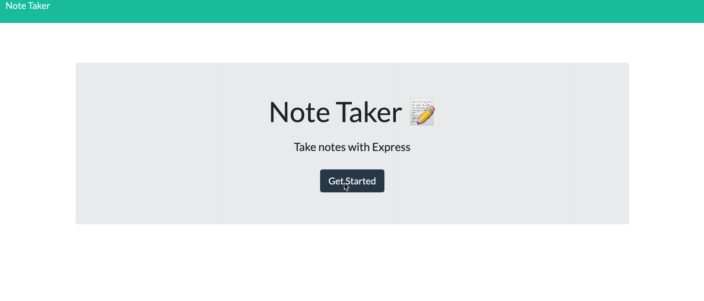

# Note Taker 
## Summary 
Note Taker is a simple app that allows you to save your notes with a title and text. This app is powered by ExpressJS. Easily Create, view and delete your notes with ease! 

## Preview 
Preview How to use the app below: 

## Heroku Deployed App Link
(https://emkaygru-notetaker.herokuapp.com)

## Github Repository Link
(https://github.com/emkaygru/NoteTaker)

## Installation Instructions 
* Clone the repository to your machine using the `git clone` command 
* Run 	`npm install` to install the necessary dependencies 
* To run the application locally (via local server) use `node server` or  `node server.js` or you can use the live deployed app via the heroku link above. 

## User Story 
As a user, I want to be able to write and save notes 
I want to be able to delete notes I've written before
 So That I can organize my thoughts and keep track of tasks I need to complete
